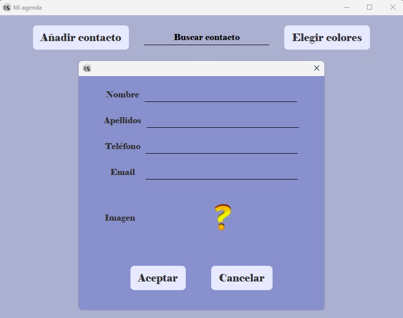
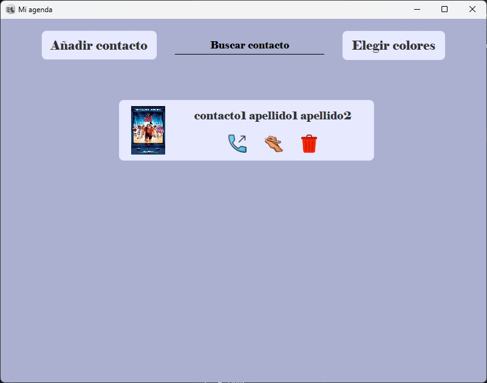
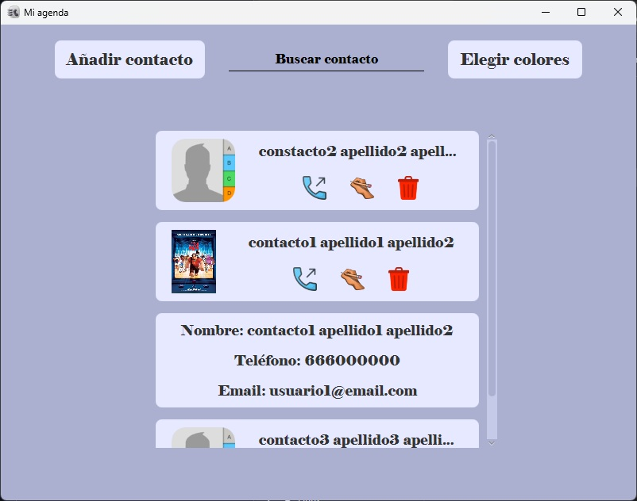

# Mi Agenda - Gestor de Contactos en JavaFX

Aplicación de escritorio para gestionar una agenda de contactos, desarrollada con **JavaFX**. Permite añadir, buscar y eliminar contactos, con foto asociada, además de personalizar el tema visual de la aplicación de forma persistente.

---

## Capturas de la Aplicación

| Listado de contactos | Formulario de nuevo contacto | Resultado de búsqueda |
| :---: | :---: | :---: |
|  |  |  |

---

## Funcionalidades

- **Listado de contactos:** vista general con foto, nombre completo y accesos rápidos para llamar, editar y eliminar cada contacto.
- **Añadir contacto:** formulario modal con campos de nombre, apellidos, teléfono, email e imagen de perfil.
- **Buscar contacto:** barra de búsqueda que filtra el listado y muestra el detalle del contacto seleccionado (nombre, teléfono y email).
- **Eliminar contacto:** borrado directo desde la tarjeta del contacto mediante icono de papelera.
- **Elegir colores:** selector de tema visual de la aplicación, con persistencia entre sesiones.

---

## Persistencia de Datos

- **Contactos:** se serializan como objetos Java y se guardan en un archivo binario `.bin`, que se deserializa al arrancar la aplicación para recuperar el listado completo (incluye imagen y datos de contacto).
- **Tema/Configuración:** las preferencias de color elegidas por el usuario se guardan en un archivo de configuración externo, de forma que el tema seleccionado se mantiene en próximas ejecuciones.

---

## Tecnologías Utilizadas

- **Java:** Lógica de negocio y modelo de datos.
- **JavaFX:** Interfaz gráfica de escritorio (ventanas, formularios modales, componentes de lista).
- **Serialización de objetos (`Serializable`):** Persistencia de contactos en formato binario `.bin`.
- **Archivos de configuración externos:** Almacenamiento de preferencias de tema/color.

---

## Estructura Sugerida del Repositorio

```text
├── src/
│   ├── model/          # Clase Contacto (Serializable)
│   ├── controller/      # Controladores de las vistas JavaFX
│   └── view/            # Archivos FXML de las ventanas
├── resources/
│   └── config.properties   # Archivo de configuración externo (tema/colores)
├── data/
│   └── contactos.bin       # Archivo binario con los contactos serializados
└── README.md
```

---

## Cómo ejecutar la aplicación

1. Clona el repositorio:
   ```bash
   git clone https://github.com/TamezeDev/mi-agenda.git
   ```
2. Ábrelo con tu IDE (IntelliJ IDEA, Eclipse) con soporte para JavaFX configurado, o compílalo y ejecútalo
3. Puedes descargarlo directamente y probarlo desde un sistema Windows mediante el ejecutable
[Descarga desde aqui](https://drive.google.com/file/d/1ftLekDh_MSjhMXzP2v1EQ5lYfVEo-IV1/view?usp=sharing)
